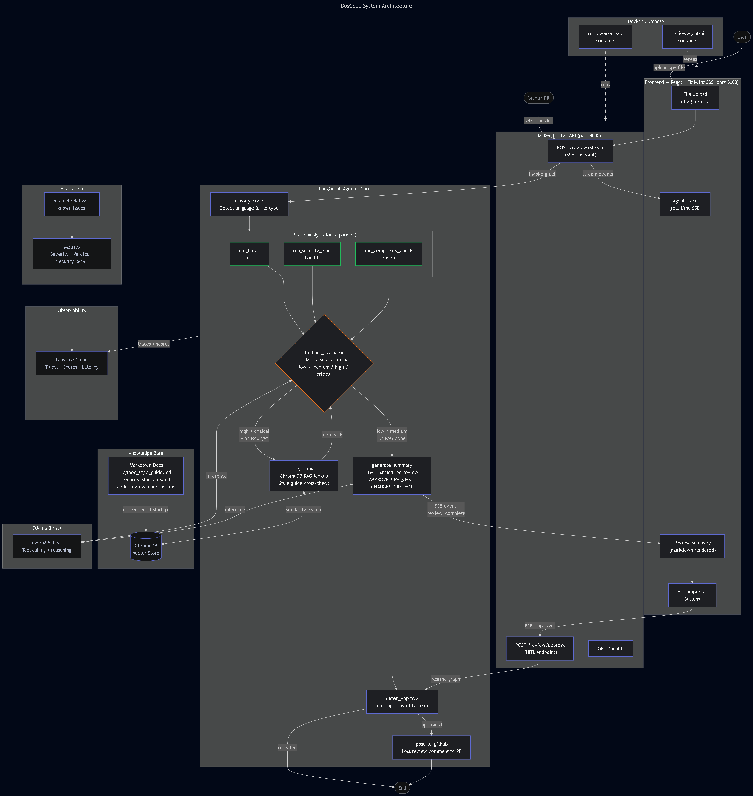

# DosCode: Code Review Assistant

Agentic AI system yang melakukan code review secara otomatis menggunakan 
LangGraph dynamic routing, RAG-based style guide lookup, dan human-in-the-loop 
approval sebelum posting ke GitHub PR.

## Architecture

```

```

## Key Features
- **Agentic behavior** — LLM decides which tools to call and when
- **Dynamic routing** — findings_evaluator loops back to RAG for serious issues
- **Human-in-the-loop** — approval required before posting to GitHub PR
- **Real-time streaming** — agent reasoning trace via SSE
- **Observability** — full tracing via Langfuse

## Stack
- **Agent**: LangGraph + Ollama (qwen2.5:1.5b)
- **RAG**: ChromaDB + SentenceTransformers
- **Static Analysis**: ruff + bandit + radon
- **Backend**: FastAPI + SSE streaming
- **Frontend**: React + TailwindCSS
- **Observability**: Langfuse
- **Infra**: Docker Compose

## Quick Start

```bash
# 1. Clone & setup
git clone https://github.com/username/reviewagent
cd reviewagent
cp .env.example .env  # fill in your keys

# 2. Pull Ollama model
ollama pull qwen2.5:1.5b

# 3. Run with Docker
docker-compose up

# 4. Open browser
open http://localhost:3000
```

## Evaluation Results
| Metric | Score |
|--------|-------|
| Severity detection (±1 level) | 80% |
| Security recall | 100% |
| Avg response time | ~34s |

## What Makes This Different from MediAgent
MediAgent uses a fixed linear pipeline. ReviewAgent implements true agentic 
behavior — the LLM dynamically decides tool selection, loops back for deeper 
investigation when needed, and requires human approval before taking real-world 
actions.